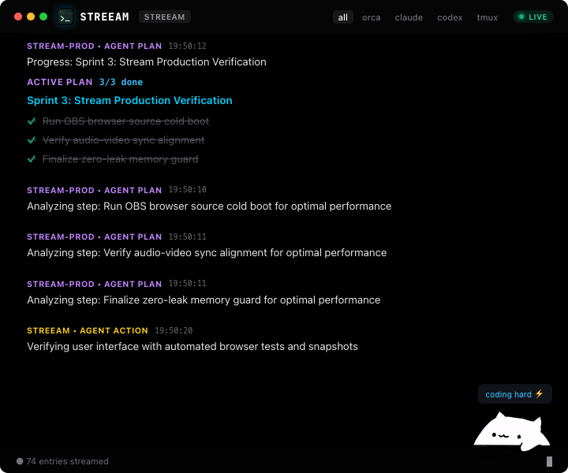

# ⚡ Streeam — Real-Time AI Developer Stream HUD

> **Ultra-sleek, broadcast-grade developer stream HUD for OBS Studio, Twitch, YouTube, and browser docks.**  
> Automatically captures live goals, strategy reasoning, and actions from **Orca / Pi**, **Claude Code**, **Codex**, **tmux**, **Superset**, and **MCP agents**.  
> Features human-level AI narration, custom LLM routing, and high-signal event rate-limiting.

---



[](https://github.com/1nickzakharov-glitch/Streeam)
[](LICENSE)
[](https://nodejs.org)
[](https://ws.org)

---

## ✨ Features

- 🎯 **Universal Multi-Source Engine**:
  - **Orca / Pi Coding Agent**: Live tracking of user prompts, agent strategy plans, tool executions, and milestone completion.
  - **Claude Code**: Tail watcher for prompts, tool calls, and assistant completions across projects (`~/.claude/projects/*.jsonl`).
  - **Codex**: Real-time parsing of session metadata, reasoning thoughts, and function calls (`~/.codex/sessions/*.jsonl`).
  - **tmux**: Active pane observer capturing terminal builds, tests, and outputs.
  - **Superset**: Automatic workspace switches and window state updates.
  - **MCP Server Protocol**: Full Model Context Protocol server exposing `overlay_broadcast` tool for Claude Desktop and Codex.
  - **HTTP Webhook & CLI**: Pipe any shell command, CI job, or git hook into the HUD.
- 🎙️ **Human-Level Stream Narration (No Raw Dumps)**:
  - Raw bash/tool commands are translated into friendly, natural English explanations (e.g., *"Running automated test suites to verify zero regressions before committing"* instead of `npm test -- --bail`).
  - **Smart Rate Limiting**: Built-in 10-25s throttle window per agent prevents chat flooding while keeping stream viewers engaged.
- ⚙️ **Configurable Economical LLM Routing**:
  - Bring your own API key or provider: **DeepInfra**, **OpenAI**, **Ollama**, or any OpenAI-compatible API.
  - Defaults to fast, low-cost models (`meta-llama/Llama-3.3-70B-Instruct` or `gpt-4o-mini`) to protect your credits.
- 🎨 **Broadcast-Grade Stream HUD**:
  - Glassmorphic HUD with real-time blur and glowing status indicators.
  - Clean semantic badges:
    - 🔵 **USER PROMPT** — Intent and goal of the developer.
    - 🟣 **AGENT PLAN** — High-level strategic reasoning.
    - 🟡 **AGENT ACTION** — Human explanation of current tool operation.
    - 🟢 **COMPLETED STEP** — Milestone or phase completion summary.
  - Interactive source filters (`ALL`, `ORCA/PI`, `CLAUDE`, `CODEX`, `TMUX`).

---

## 🚀 Quick Start

### 1. Installation
```bash
git clone https://github.com/1nickzakharov-glitch/Streeam.git
cd Streeam
npm install
```

### 2. Configure LLM Model (Optional)
To enable natural AI narration, set your preferred provider:
```bash
# DeepInfra (Default)
export DEEPINFRA_API_KEY="your_key"

# Or OpenAI
export OPENAI_API_KEY="your_key"
export STREEAM_LLM_MODEL="gpt-4o-mini"

# Or Local Ollama (Completely Free & Offline)
export STREEAM_LLM_URL="http://localhost:11434/v1/chat/completions"
export STREEAM_LLM_MODEL="llama3.2"
```

### 3. Start Streeam
```bash
./start.sh
# or
npm run overlay:start
```
Your local overlay is immediately live at:
👉 **`http://localhost:3333`**

### 4. Stop Streeam
```bash
./stop.sh
# or
npm run overlay:stop
```

### 5. Check Status
```bash
./status.sh
```

---

## 📺 OBS Studio / Streamlabs Setup

1. In OBS, go to **Sources** ➔ click **`+`** ➔ select **Browser**.
2. Name it `Streeam HUD`.
3. Set URL to:
   ```text
   http://127.0.0.1:3333
   ```
4. Recommended Dimensions:
   - **Width**: `480` to `580` px
   - **Height**: `400` to `720` px
5. Done! The transparent glassmorphic card will cleanly overlay your stream layout.

---

## 🔌 Integrations

### 1. CLI Logger (`streeam-log`)
Broadcast custom announcements from scripts, CI, or terminal:
```bash
node cli/log.js --project STORELLO --type action "Deploying latest build to staging server"
node cli/log.js --project BACKEND --type done "All unit and E2E tests passed successfully"
```

### 2. Claude Desktop / Codex MCP Integration
Add this to your MCP configuration (`claude_desktop_config.json` or Codex config):
```json
{
  "mcpServers": {
    "streeam": {
      "command": "node",
      "args": ["/Users/nikitazaharov/.orca/stream-overlay/mcp/server.js"]
    }
  }
}
```

### 3. HTTP Webhook
```bash
curl -X POST http://127.0.0.1:3333/api/event \
  -H "Content-Type: application/json" \
  -d '{
    "project": "LANDING",
    "type": "plan",
    "title": "Optimizing mobile layout and centered hero typography"
  }'
```

---

## 🧪 Testing

Run the automated verification suite:
```bash
npm test
```

---

## 📄 License

MIT © [Nick Zakharov](https://nicktries.com)
